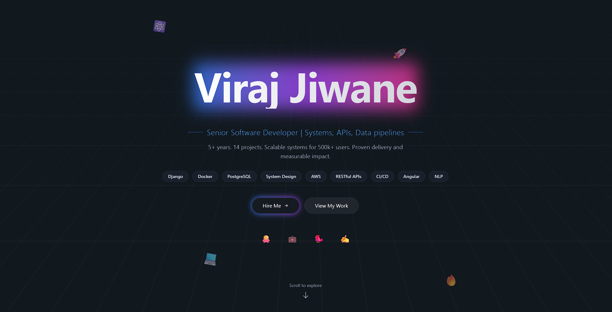

# 🧭 Viraj Jiwane — Portfolio

**Live:** [https://virajjiwane.onrender.com](https://virajjiwane.onrender.com)  
**Source:** [https://github.com/virajjiwane/whoami](https://github.com/virajjiwane/whoami)

After weeks of design, refinement, and countless commits — this portfolio is finally live.  
Built entirely from scratch with **Angular 20**, **Tailwind CSS**, and **EmailJS**, it reflects my personal development philosophy: **clarity, precision, and discipline**.

---

## 🚀 Tech Stack

- **Framework:** Angular 20  
- **Styling:** Tailwind CSS  
- **Email Integration:** EmailJS  
- **Deployment:** Render (static hosting)  
- **Design:** Responsive, dark, minimalist  

---

## 🧩 Features

- Dynamic sections for projects, skills, and contact  
- Responsive layout for all screen sizes  
- Contact form powered by EmailJS  
- SEO meta tags for clean sharing previews  
- Modular Angular architecture  

---

## 🛠️ Run Locally

```bash
git clone https://github.com/virajjiwane/whoami.git
cd whoami
npm install
ng serve
```

Then open http://localhost:4200 in your browser.

# ❤️ Show Love
If you liked the project:

⭐ Star this repo to support it

🗣️ Share it with your network

🧠 Fork it to build your version (credit appreciated)

💬 Drop feedback under Issues

Every star, share, or comment helps me keep shipping cool things.

# 📷 Preview


# 🧠 About
This portfolio blends aesthetics, performance, and modular design.
Built over weeks of focused work — nothing rushed, nothing wasted.

# 📬 Contact
## Viraj Jiwane
- 📧 [Email](mailto:vjiwane27@gmail.com)
- 🌐 [Portfolio](virajjiwane.onrender.com)
- 💼 [LinkedIn](https://www.linkedin.com/in/viraj-jiwane-33aa2b126/)
- 🐙 [GitHub](https://github.com/virajjiwane/)

🪪 License
This project is released under the MIT License.